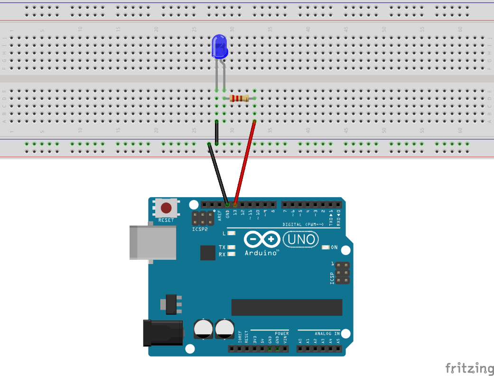

#Blink

Este projeto tem como objetivo demonstrar como realizar o acionamento e desacionamento de um LED.

## Lista de materiais

 - 1 Arduino Uno Rev 3
 - Cabo USB Tipo A-B
 - 1 Led;
 - 1 Resistor 220Ω

## Modelo esquemático em Protoboard



??? note "Código"
    ```c
    int led = 13;

    void setup() {

        pinMode(led, OUTPUT);

    }
    void loop() {

        digitalWrite(led, HIGH);
        delay(1000); 
        digitalWrite(led, LOW); 
        delay(1000);
    }
    ```

??? note "Código Comentado"
    ```c
    int led = 13;

    void setup() {

        pinMode(led, OUTPUT);

    }
    void loop() {

        digitalWrite(led, HIGH);
        delay(1000); 
        digitalWrite(led, LOW); 
        delay(1000);
    }
    ```

## Arquivos para Download

[](../arq/blink.ino)          [](../arq/blink.fzz)