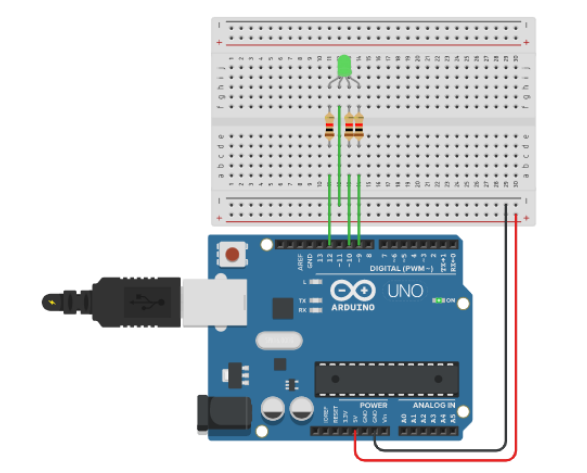

#Led RGB

Este projeto tem como objetivo demonstrar como podemos programar o funcionamento de um Led RGB.

## Lista de materiais

 - 1 Arduino Uno Rev 3
 - 1 Led RGB
 - 3 Resistor 220Ω

## Modelo esquemático em Protoboard



??? note "Código"
    ```c
    int vermelho = 6; 
    int verde = 5; 
    int azul = 3; 

    void setup() {
        pinMode(vemelho, OUTPUT); 
        pinMode(verde, OUTPUT); 
        pinMode(azul, OUTPUT); 
    }
    void loop() {
        analogWrite(vermelho, 255);
        delay(1000);
        analogWrite(vermelho, 0);
        analogWrite(verde, 255);
        delay(1000);
        analogWrite(verde, 0);
        analogWrite(azul, 255);
        delay(1000);
        analogWrite(azul, 0);
        delay(1000);
    }
    ```

??? note "Código Comentado"
    ```c
    int vermelho = 6; 
    int verde = 5; 
    int azul = 3; 

    void setup() {
        pinMode(vemelho, OUTPUT); 
        pinMode(verde, OUTPUT); 
        pinMode(azul, OUTPUT); 
    }
    void loop() {
        analogWrite(vermelho, 255);
        delay(1000);
        analogWrite(vermelho, 0);
        analogWrite(verde, 255);
        delay(1000);
        analogWrite(verde, 0);
        analogWrite(azul, 255);
        delay(1000);
        analogWrite(azul, 0);
        delay(1000);
    }
    ```

## Arquivos para Download

[](../arq/)          [](../arq/)