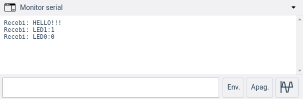

#Print String

Este projeto tem como objetivo demonstrar como realizar a leitura e escrita de texto com o Arduino

## Lista de materiais

 - Arduino Uno Rev 3
 - Cabo USB Tipo A-B

## Modelo esquemático em Protoboard



??? note "Código"
    ```c

    int led = 13;
    
    void setup() { 
        pinMode(led, OUTPUT); 
        Serial.begin(9600);
    }
        
    String leStringSerial(){
        String conteudo = "";
        char caractere;
        
        while(Serial.available() > 0) {
            
            caractere = Serial.read();
            if (caractere != '\n'){
                conteudo.concat(caractere);
            }
            
        delay(10);
    }
            
        Serial.print("Recebi: ");
        Serial.println(conteudo);
            
        return conteudo;
    }
    
    void loop() {

        if (Serial.available() > 0){
         
            String recebido = leStringSerial();
            
            if (recebido == "LED1:1"){
            digitalWrite(led, HIGH);
            }
            
            if (recebido == "LED1:0"){
            digitalWrite(led, LOW);
            }
        }
    }

    ```

??? note "Código Comentado"
    ```c

    int led = 13;
    
    void setup() { 
    pinMode(led, OUTPUT); 
    Serial.begin(9600);
    }
    
    /**
    * Função que lê uma string da Serial
    * e retorna-a
    */
    String leStringSerial(){
    String conteudo = "";
    char caractere;
    
    // Enquanto receber algo pela serial
    while(Serial.available() > 0) {
        // Lê byte da serial
        caractere = Serial.read();
        // Ignora caractere de quebra de linha
        if (caractere != '\n'){
        // Concatena valores
        conteudo.concat(caractere);
        }
        // Aguarda buffer serial ler próximo caractere
        delay(10);
    }
        
    Serial.print("Recebi: ");
    Serial.println(conteudo);
        
    return conteudo;
    }
    
    void loop() {
    // Se receber algo pela serial
    if (Serial.available() > 0){
        // Lê toda string recebida
        String recebido = leStringSerial();
        
        if (recebido == "LED1:1"){
        digitalWrite(led, HIGH);
        }
        
        if (recebido == "LED1:0"){
        digitalWrite(led, LOW);
        }
    }
    }

    ```

## Arquivos para Download

[](../arq/)         [](../arq/)