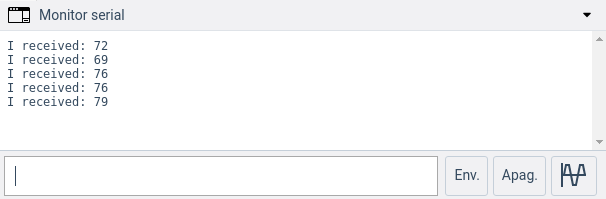

#Serial Read

Este projeto tem como objetivo demonstrar o uso da função [Serial.read()](https://www.arduino.cc/reference/pt/language/functions/communication/serial/read/)

## Lista de materiais

 - Arduino Uno Rev 3
 - Cabo USB Tipo A-B

## Modelo esquemático em Protoboard



??? note "Código 1"
    ```c
    int incomingByte = 0; 

    void setup() {
      Serial.begin(9600); 
    }

    void loop() {
      
        if (Serial.available() > 0) {
        
            incomingByte = Serial.read();

            Serial.print("I received: ");
            Serial.println(incomingByte, DEC);
        }
    }
    ```

??? note "Código Comentado 1"
    ```c
    int incomingByte = 0; 

    void setup() {
      Serial.begin(9600); 
    }

    void loop() {
      
        if (Serial.available() > 0) {
        
            incomingByte = Serial.read();

            Serial.print("I received: ");
            Serial.println(incomingByte, DEC);
        }
    }
    ```

??? note "Código 2"
    ```c
    int incomingByte = 0; 
    char inData[2];


    void setup() {
        Serial.begin(9600); 
    }

    void loop() {
        if (Serial.available() > 0) {
                incomingByte = Serial.read();
                Serial.print("I received: ");
                inData[0] = incomingByte;
                inData[1] = '\0'; 
                Serial.println(inData);
        }
    }
    ```

??? note "Código Comentado 2"
    ```c
    int incomingByte = 0; 
    char inData[2];


    void setup() {
        Serial.begin(9600); 
    }

    void loop() {
        if (Serial.available() > 0) {
                incomingByte = Serial.read();
                Serial.print("I received: ");
                inData[0] = incomingByte;
                inData[1] = '\0'; 
                Serial.println(inData);
        }
    }
    ```

## Arquivos para Download

[](../arq/)          [](../arq/)