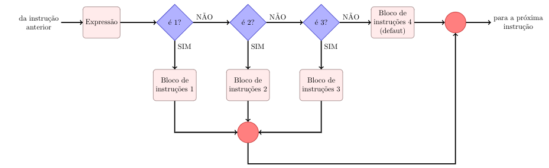
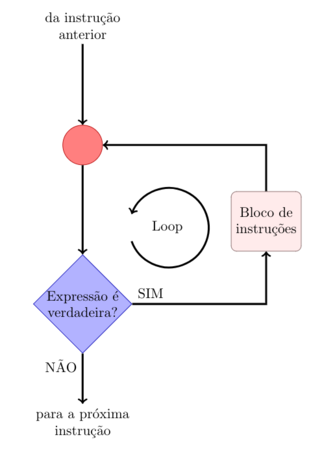

Trabalhar com [Arduino](https://www.arduino.cc/) é bastante simples sua programação é dividida em dois blocos que são escritos em linguagem C/C++. Um dos blocos no escopo do código é o void [setup()](https://www.arduino.cc/reference/pt/language/structure/sketch/setup/), onde faremos a configuração dos pinos a serem utilizados. No outro bloco, o void [loop()](https://www.arduino.cc/reference/pt/language/structure/sketch/loop/), será executado o código de comando  em ciclos repetitivos. Abaixo segue o exemplo mais simples disponível mostrando o uso dos dois blocos:

```c
int led = 13;
void setup() {
pinMode(led, OUTPUT);
}
void loop() {
digitalWrite(led, HIGH); 
delay(1000); 
digitalWrite(led, LOW); 
delay(1000); 
}
```

O código acima é um simples teste onde o primeiro bloco está dizendo que o pino 13 (led) do Arduino será saída, e no segundo está dizendo que a saída será alta (5V) por mil milissegundos (1 segundo) e em seguida ficará desligada também por mil milissegundos. Vale observar que a função [delay()](https://www.arduino.cc/reference/pt/language/functions/time/delay/) conta o tempo em milissegundos.

## Operadores

Saber usar os operadores de maneira correta é essencial na programação tanto operadores aritméticos, lógicos e de comparação, por isso segue abaixo a tabela com os símbolos e suas respectivas funções:


| Símbolos | Funções                  | Tipo       |
|----------|--------------------------|------------|
| x++      | x = x + 1                | Aritmética |
| x--      | x = x - 1                | Aritmética |
| x += y   | x = x + y                | Aritmética |
| x -= y   | x = x - y                | Aritmética |
| x \*= y   | x = x \* y              | Aritmética |
| x /= y   | x = x / y                | Aritmética |
| x ==y    | x É igual a y            | Comparação |
| x != y   | x é diferente de y       | Comparação |
| x < y    | x é menor que y          | Comparação |
| x > y    | x é maior que y          | Comparação |
| x <= y   | x é menor igual y        | Comparação |
| x >= y   | x é maior igual y        | Comparação |
| &&       | Porta lógica “E” (AND)   | Lógicos    |
| ||       | Porta lógica “OU” (OR)   | Lógicos    |
| !        | Porta lógica “NÃO” (NOT) | Lógicos    |

## Constantes

Constantes são valores que não podem ser alterados, normalmente assumem dois valores e podem ser interpretados como números binários 0 (zero) e 1 (um).

- TRUE/FALSE: são constantes booleanas que definem estados lógicos. Verdadeiro é qualquer valor que não seja zero. Falso é sempre o valor zero.
- HIGH/LOW: essas constantes definem as tensões nos pinos digitais do Arduino. Alto é uma tensão de 5 volts; baixo, o terra (ou 0 volt).
- INPUT/OUTPUT: são constantes programadas pela função [pinMode()](https://www.arduino.cc/reference/pt/language/functions/digital-io/pinmode/) para os pinos do Arduino; eles podem ser entradas (de sensores), INPUT ou podem ser saídas (de controle), OUTPUT.

## Variáveis

As variáveis são posições na memória do programa que possuem um nome e o tipo de informação que irão guardar. Essas posições podem inicialmente estar vazias ou contar algum valor e sempre podem ser alteradas pelo programa ou pelo programador. A variável deve ser declarada antes de ser chamada e deve constituir de um nome e o tipo. Uma variável pode ser global ou local de acordo de onde ela foi declarada, se for logo no início, antes da função void setup(), ela será global e pode ser usada e “vista” por qualquer função do programa. Se for declarada dentro de uma função, ela será local e será usada e “vista” somente por essa função.
- byte - esse tipo armazena 8 bits (0-255);
- int - armazena números inteiros de até 16 bits;
- long - armazena números inteiros de até 32 bits;
- float - variáveis deste tipo podem armazenar números fracionários de até 32 bits.
As vezes temos que guardar várias variáveis do mesmo tipo e usá-las com frequência. Sendo assim, guardamos em vetores. Abaixo mostramos como montar vetores no Arduino, lembrando que sempre a primeira posição será a posição 0.
- Para declarar vetores diga seu tipo e um nome seguido de colchetes, quando declarar valores separe-os com vírgula e sempre entre chaves como no exemplo: `int nomeVetor [ ] = {1, 3, 4, 7}`; 
- Pode-se também declarar o tamanho do vetor, para isso coloque o número de termos entre os colchetes como no exemplo: `int nomeVetor[13]`;
- Pode-se também armazenar um determinado valor em um lugar específico do vetor como no exemplo que guarda um inteiro de valor 2 na posição 8 do vetor: `int nomeVetor[8]= 2`;

## Funções

Muitas vezes precisamos executar a mesma tarefa diversas vezes. Quando isso acontece, para diminuir as chances de erros e deixar o código mais claro criamos funções. No Arduino também utilizamos muito essa ferramenta. Abaixo segue de modo simplificado como criar funções no Arduino e tem basicamente a seguinte estrutura:

- Tipo da função (int, float, char, bool, etc)
- Nome da função (o nome que achar melhor)
- Os parâmetros que são passados para a função
- Operação que deseja que a função execute
- Retorno do valor (ou valores) que a função calculou

Abaixo temos um exemplo de função que recebe os valores de a, b, c, calcula as raízes e retorna a raiz positiva x1;

```c
int bhaskaraFunction(int a, b, c) {
  double delta, x1, x2;
  delta = sq(b) - 4 * a * c;
  x1 = (-b + sqrt(delta)) / 2;
  x2 = (-b - sqrt(delta)) / 2;
  return x1;
}
```

Temos funções na biblioteca do Arduino que são muito úteis. Essas funções podem ser de tempo, matemáticas e de entrada e saída. Segue algumas principais delas com seus respectivos usos:

|                       | Funções Matemáticas        |                                                                               |
|-----------------------|----------------------------|-------------------------------------------------------------------------------|
| Função                | Função                     | Descrição                                                                     |
| pow(base, exp)        | pow(base, exp)             | Elevar um número à potência                                                   |
| sq(x)                 | sq(x)                      | Eleva x ao quadrado                                                           |
| sqrt(k)               | sqrt(k)                    | Raiz quadrada de k                                                            |
| abs(y)                | abs(y)                     | Módulo de y, valor absoluto                                                   |
| min(x, y)             | min(x, y)                  | Retorna menor número entre x e y int                                          |
| max(x, y)             | max(x, y)                  | Retorna maior número entre x e y int                                          |
| random(min, max)      | random(min, max)           | Retorna número aleatório entre min e max                                      |


|                       | Funções de Tempo           |                                                                               |
|-----------------------|----------------------------|-------------------------------------------------------------------------------|
| delay(ms)             | delay(ms)                  | Pausa o programa por ms milissegundos                                         |
| delayMicroseconds(us) | delayMicroseconds(us)      | Pausa o programa por us microsegundos                                         |
| millis(t) / micro(us) | millis(t) / micro(us)      | Tempo em milissegundos / micro segundos desde que programa começou a executar |


|                       | Funções de Entrada e Saída |                                                                               |
|-----------------------|----------------------------|-------------------------------------------------------------------------------|
| pinMode(pin, I/O)     | pinMode(pin, I/O)          | Configura pino específico para ser I/O                                        |
| digitalWrite( )       | digitalWrite( )            | Escreve HIGH/LOW em um pino digital                                           |
| digitalRead( )        | digitalRead( )             | Lê HIGH/LOW no pino digital específico                                        |
| analogWrite( )        | analogWrite( )             | Escreve valor analógico PWM em um pino                                        |
| analogRead( )         | analogRead( )              | Lê valor de tensão no pino específico                                         |

## Estruturas de Seleção

Em diversos momentos precisamos definir pontos de escolha em nossos programas de tal forma a mudar o fluxo de eventos do algortmo. Para isso temos as chamadas estruturas de seleção, as quais nos permitem tomar tais escolhas dentro do programa.

### If (condicional) e if... Else

É um laço de controle de fluxo onde ele executa certas instruções somente se as condições dentro dos parênteses forem aceitas. As instruções devem ser colocadas depois do if e dentro de chaves (recomendado) ou não. Exemplo de uso do if:

```c
if (x > 120)
  digitalWrite(LEDpin1, HIGH);
if (x < 120)
  digitalWrite(LEDpin, HIGH);
if (x > 120) {
  digitalWrite(LEDpin2, HIGH);
}
if (x = 120) {
  digitalWrite(LEDpin1, HIGH);
  digitalWrite(LEDpin2, HIGH);
}
```


Se acrescentarmos mais um bloco de instruções, pode-se criar o comando if... else, que nada mais é se a primeira condição (if) não for satisfeita o programa atua com as instruções dentro de else. O exemplo abaixo ilustra isso:

```c
If(x > 120) {
  digitalWrite(LEDpin1, HIGH);
  digitalWrite(LEDpin2, HIGH);
} else {
  digitalWrite(LEDpin1, LOW);
  digitalWrite(LEDpin2, LOW);
}
digitalWrite(LEDpin2, HIGH);
```


### Switch...case
Esse laço controla o fluxo de programas permitindo o programador especificar diferentes códigos que deverão ser executados em diferentes condições. O switch compara o valor especificado com as sentenças e quando o valor é o mesmo, ele executa o código. Usualmente coloca-se a palavra break, assim quando uma condição é aceita o programa para de executar e pula para a próxima ação.

```c
switch (var) {
case var = 1:
  digitalWrite(LEDpin1, HIGH);
  break;
case var = 2:
  digitalWrite(LEDpin1, LOW);
  break;
case var = 3:
  digitalWrite(LEDpin2, HIGH);
  break;
case var = 4:
  digitalWrite(LEDpin2, LOW);
  break;
}
```


## Estruturas de Repetição

Nos códigos dos programas muitas vezes é preciso executar uma função diversas vezes ou até que uma certa condição seja satisfeita. Para isso, usamos os comandos de laço que nada mais são comandos de repetição para se fazer uma determinada tarefa ou estabelecer o que fazer caso ela não seja feita. Os laços mais comuns são:

### While

É um dos laços mais usado nos programas. Sua função é executar determinadas instruções até que uma condição inicialmente verdadeira se torne falsa ou o contrário.

```c
var = 0;
while (var < 200) {
  digitalWrite(LEDpin1, HIGH)
  var ++;
}
```



### For

A declaração for é a mais utilizada na programação e é usada para repetir as instruções colocadas entre chaves. Normalmente se usa um contador para fazer o ciclo desejado. Esse laço é dividido em três partes: for(inicialização; condição; incremento). Note que cada parâmetro dentro do parênteses é separado por ponto e vírgula.

```c
int PWMpin = 10;
void setup() {}
void loop() {
  for (int i = 0; i <= 255; i++) {
    analogWrite(PWMpin, i);
    delay(10);
  }
}
```


