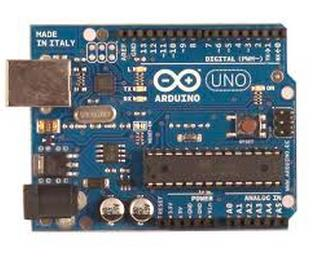
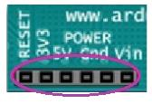
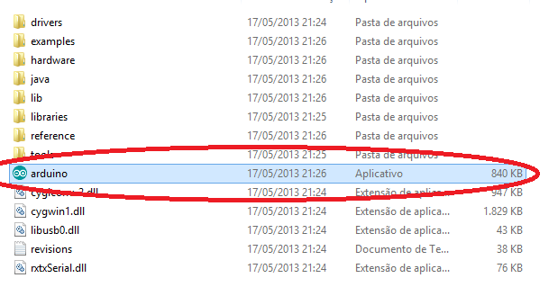
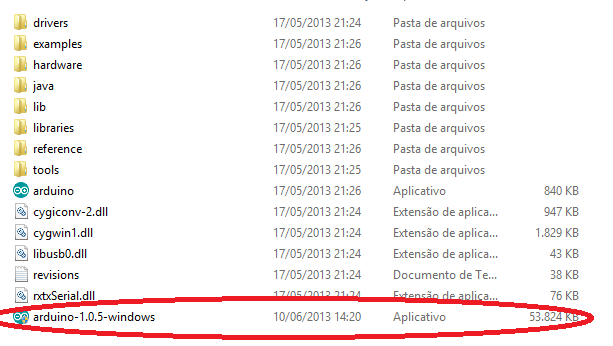
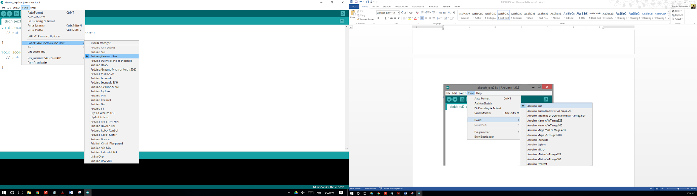
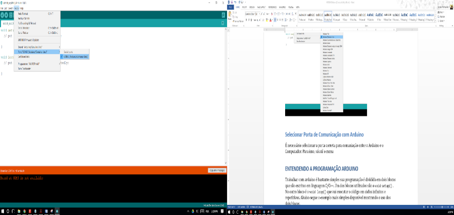

#Introdução

## O Que é exatamente um Arduino?
O Arduino é uma placa composta por um microcontrolador Atmel, circuitos de entrada/saída e que pode ser facilmente conectada à um computador e programada via IDE (Integrated Development Environment, ou Ambiente de Desenvolvimento Integrado), utilizando uma linguagem baseada em C/C++ sem a necessidade de equipamentos extras além de um cabo USB.
Em outras palavras, Arduino é um pequeno computador que você pode programar através de outro computador, utilizando um software (IDE) para processar sinais de entradas e acionar saídas. O Arduino funcionará independente de um computador posteriormente.

## O que fazemos com um Arduino
As possibilidades de aplicação com Arduino são infinitas. Os programas são extremamente flexíveis, ou seja, podem ser alterados para executar as funções exatamente como desejado.
Há também uma enorme gama de sensores e atuadores, que são conectados as Entradas e Saídas do Arduino. Esses sensores e atuadores são conhecidos como módulos. Os módulos podem ser utilizados em um projeto para ler sinais específicos, como corrente, temperatura, etc. e acionar atuadores específicos, como lâmpadas, reles, etc.
A Imagem abaixo ilustra alguns dos módulos mais comuns:

Fonte: https://www.filipeflop.com/blog/o-que-e-arduino/

## Como funciona o Arduino

A placa Arduino UNO é composta por 14 entradas e saídas digitais, das quais 6 podem ser usadas como PWM, além de conter 6 entradas analógicas. As 6 entradas analógicas estão nos pinos denominados A0 até A5. Os pinos que podem ser usados como saída PWM são os 3, 5, 6, 9, 10 e 11 usando a função analogWrite. Há também os pinos TX (que transmitem) e RX (que recebe) dados via serial que podem ser enviados a módulos que convertem esse sinal em outra forma, como por exemplo um módulo Bluetooth.

O Arduino pode ser alimentado tanto via USB como por fonte externa (DC ou bateria). A placa trabalha com tensão entre 6V a 20V, porém usando menos que 7V, o pino de alimentação de 5V pode fornecer menos que isso e a placa ficará instável. Já uma tensão acima de 12V pode causar algum dano à ela. Sendo assim a faixa ideal de tensão para se trabalhar é entre 7V a 12V. O pino Vin é um pino interligado diretamente à entrada de tensão realizada no plug DC, ou seja, se eu estiver entrando com 12V no pino de DC, estará saindo 12V no Vin. Os pinos 5V e 3V3 fornecem esses respectivos valores de tensão para um circuito externo (protoboard), os dois pinos Gnd são terra e o pino RESET serve para resetar o Arduino quando fornecido tensão nele. A figura abaixo mostra esses pinos.

O Arduino pode fornecer e receber apenas 40mA em cada pino, podendo danificá-la caso seja fornecido uma corrente maior. Há também um resistor de pull up interno de 20-50 kOhm.

A quadro abaixo mostra os dados completos da placa Arduino UNO.

|                                 |                            |
|---------------------------------|----------------------------|
| Microcontrolador                | ATmega328                  |
| Tensão de operação              | 5v                         |
| Tensão de entrada (recomendada) | 7-12v                      |
| Tensão de entrada (limites)     | 6-20V                      |
| Pinos de I/O Digitais           | 14 (6 deles com saída PWM) |
| Pinos Analógicos                | 6                          |
| Corrente CC por I/O Pino        | 40mA                       |
| Corrente do Pino 3.3V           | 50mA                       |
| Memória Flash                   | 32 KB (ATmega328) 0.5 KB   |
| SRAM                            | 2 KB (ATmega328)           |
| EEPROM                          | 1 KB (ATmega328)           |
| Velocidade do Clock             | 16MHz                      |

## Instalando a IDE
Você vai precisar de acesso à Internet para baixar o [Arduino IDE](http://arduino.cc/en/Main/Software) (Integrated Development Environment). Após baixar o software do site você pode clicar no ícone do aplicativo para abri-lo direto, como na imagem abaixo:

Ou você pode clicar no ícone do aplicativo .exe e instalá-lo em seu PC. Não há complicações na instalação, somente aceite os termos e espere finalizar.

### Como funciona o IDE?
O IDE é dividido em três partes: a barra de ferramentas que fica na parte superior, a janela de código no centro, e na janela de mensagens na parte inferior.

### Selecionar Tipo de Arduino
Você deve conferir se o modelo da placa utilizado está configurado no programa. Para isso, vá em **Tools > Board** (na barra de ferramentas), em seguida escolha o modelo da placa Arduino que está utilizando como mostra a figura abaixo:

### Selecionar Porta de Comunicação
É necessário selecionar a porta correta para comunicação entre o Arduino e o Computador. Para isso, vá até o menu **Tools -> Port -> COM3**. A porta varia de acordo com a entrada USB que você conectou sua placa.

